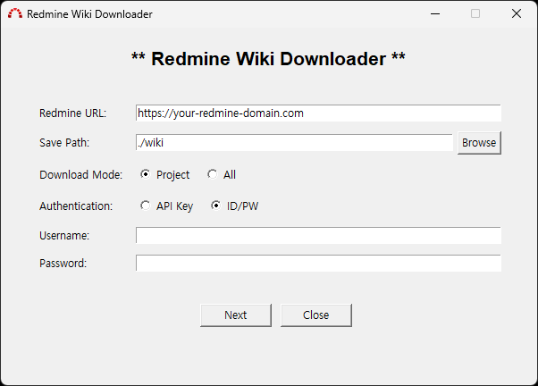
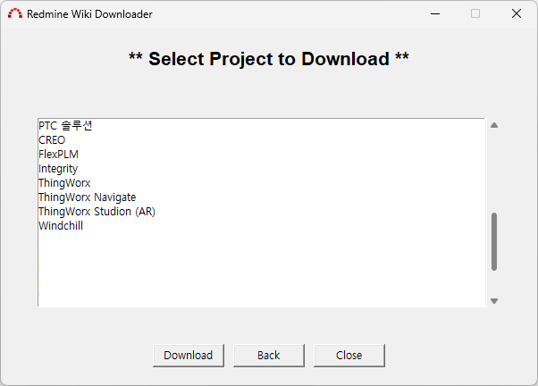
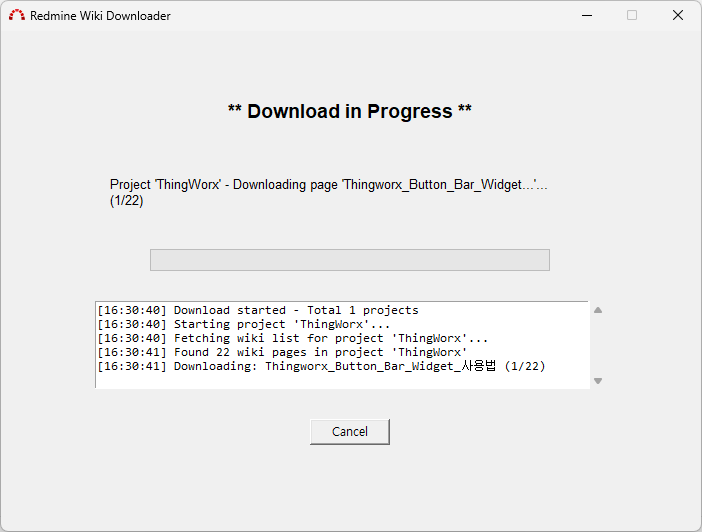
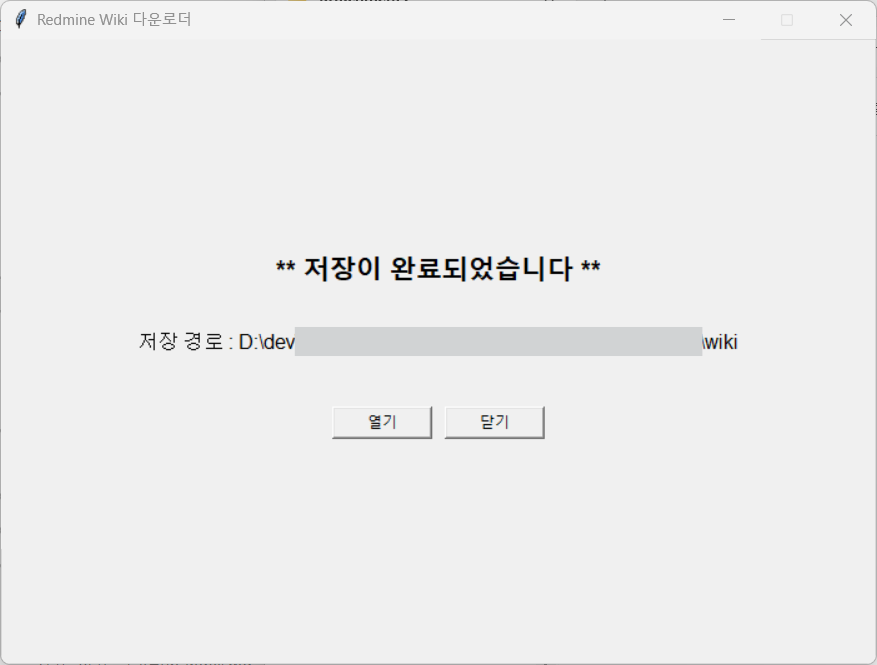

# Redmine Wiki Downloader

Redmine에서 프로젝트의 Wiki 페이지들을 일괄 다운로드하는 GUI 유틸리티입니다.

## 📦 다운로드

실행 파일을 바로 다운로드하여 사용할 수 있습니다:

**[RedmineWikiDownloader.exe 다운로드](./dist/RedmineWikiDownloader.exe)**

> ⚠️ Windows Defender에서 경고가 나타날 수 있습니다. 이는 서명되지 않은 실행 파일이기 때문이며, "추가 정보" → "실행"을 클릭하여 실행할 수 있습니다.

## 🎯 주요 기능

- **GUI 인터페이스**: 사용자 친화적인 그래픽 인터페이스
- **인증 방식 선택**: API Key 또는 ID/Password 인증 지원
- **다운로드 모드**: 특정 프로젝트 또는 전체 프로젝트 선택
- **진행상황 표시**: 실시간 다운로드 진행률 및 로그
- **마크다운 형식**: Wiki 페이지를 .md 파일로 저장
- **다중 플랫폼**: Windows, macOS, Linux 지원



## 🚀 사용 방법

### 1. 메인 화면 설정


**필수 입력 항목:**
- **Redmine URL**: Redmine 서버 주소 (예: `https://your-redmine-domain.com`)
- **Save Path**: Wiki 파일을 저장할 경로
- **Download Mode**:
  - `Project`: 특정 프로젝트만 다운로드
  - `All`: 모든 프로젝트 다운로드
- **Authentication**: 인증 방식 선택
  - `API Key`: Redmine API 키 사용
  - `ID/PW`: 사용자명/패스워드 사용

### 2. 프로젝트 선택 (Project 모드)



Project 모드를 선택한 경우, 접근 가능한 프로젝트 목록이 표시됩니다. 다운로드할 프로젝트를 선택하고 "Download" 버튼을 클릭합니다.

### 3. 다운로드 진행



다운로드가 시작되면 진행 상황을 실시간으로 확인할 수 있습니다:
- 현재 처리 중인 프로젝트와 페이지
- 전체 진행률 표시
- 상세 로그 출력
- 취소 기능

### 4. 완료



다운로드 완료 후 저장된 폴더를 바로 열 수 있습니다.

## ⚙️ 옵션 설명

### 인증 방식

| 방식 | 설명 | 장점 | 비고           |
|------|------|------|--------------|
| **API Key** | Redmine에서 발급받은 API 키 사용 | 간편하고 안전 | API 키 발급 필요  |
| **ID/PW** | 일반 로그인 정보 사용 | 별도 설정 불필요 |  |

### 다운로드 모드

| 모드 | 설명 | 용도 |
|------|------|------|
| **Project** | 특정 프로젝트만 선택하여 다운로드 | 특정 프로젝트의 Wiki만 필요한 경우 |
| **All** | 접근 가능한 모든 프로젝트 다운로드 | 전체 백업이나 마이그레이션 시 |

## 📁 출력 구조

다운로드된 파일들은 다음과 같은 구조로 저장됩니다:

```
저장경로/
├── 프로젝트명1/
│   ├── Wiki페이지1.md
│   ├── Wiki페이지2.md
│   └── ...
├── 프로젝트명2/
│   ├── Wiki페이지1.md
│   └── ...
└── ...
```

각 Wiki 페이지는 마크다운(.md) 파일로 저장되며, 파일명에는 특수문자가 제거됩니다.

## 🔧 개발자 정보

### 요구사항

- Python 3.7+
- requests >= 2.31.0

### 소스 코드 실행

```bash
# 종속성 설치
pip install -r requirements.txt

# 실행
python main.py
```

### 빌드

```bash
# PyInstaller로 실행 파일 생성
python build.py
```

## 🔍 API 키 발급 방법

1. Redmine에 로그인
2. 우측 상단 계정 메뉴 → "내 계정"
3. "API 액세스 키" 섹션에서 "표시" 클릭
4. 표시된 키를 복사하여 사용

## ⚠️ 주의사항

- **권한**: 다운로드는 현재 계정이 접근 가능한 프로젝트와 Wiki 페이지만 가능합니다
- **네트워크**: 안정적인 인터넷 연결이 필요합니다
- **용량**: 대용량 Wiki의 경우 다운로드 시간이 오래 걸릴 수 있습니다
- **파일명**: 특수문자가 포함된 Wiki 페이지명은 자동으로 변환됩니다

## 📄 라이선스

이 프로젝트는 개인 및 상업적 용도로 자유롭게 사용할 수 있습니다.

## 🐛 문제 신고

버그나 기능 요청이 있으시면 이슈를 등록해 주세요.